## NeoLogger

NeoLogger makes command line log more detailed and meaningful.

The structure of the log for the basic form as follow:  
_timestamp - file >> function | log message_

### 1 - Usage

Import classes

```
from neologger import NeoLogger
```

Create an NeoLogger object, pass the name of the file where the object is created.

```
neologger = NeoLogger("test_neolloger.py")
```

Call the basic logging method.

```
neologger.log_this("Starting NeoLogger")
```

Output:
<p align="center">
  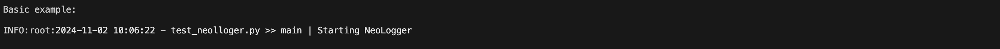
</p>

### 2- Labels

NeoLogger includes the possibility to visually display labels that differentiate logs, currently as for version 1.1.0, you can add labels for OK, WARNING, COMPLETED, SUCCESS, and ERROR.   
To add a label to the output, just call the proper method, as follow:

* OK 
```
neologger.log_this_ok("Function completed Ok.")
```
Output:
<p align="center">
  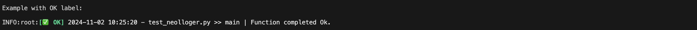
</p>

* WARNING 
```
neologger.log_this_warning("Data was sent uncompleted")
```
Output:
<p align="center">
  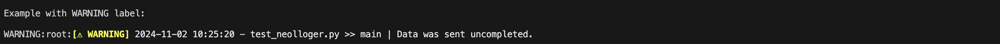
</p>

* COMPLETED 
```
neologger.log_this_completed("Data collection stage completed.")
```
Output:
<p align="center">
  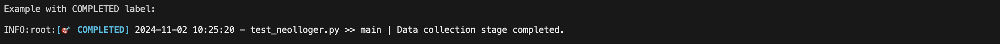
</p>

* SUCCESS 
```
neologger.log_this_success("Request has been completed successfuly")
```
Output:
<p align="center">
  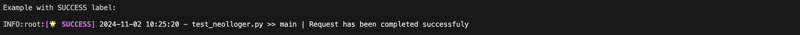
</p>

* ERROR 
```
neologger.log_this_error("Something went wrong!")
```
Output:
<p align="center">
  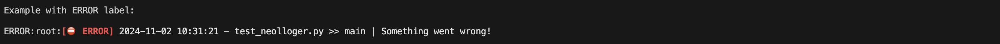
</p>

### 3 - Templates
Templates allow to display logs with predefined colours, to include a Template with NeoLogger you need to import the Template class from the neologger.core package.    
Templates can be changed at anytime in runtime.

```
from neologger.core import Template
```

As in version 1.1.0, the following Templates are available: BASE, NORMAL, DARK

* BASE 
```
neologger.set_template(Template.BASE)
neologger.log_this("NeoLogger has been set with BASE Template")
```
Output:
<p align="center">
  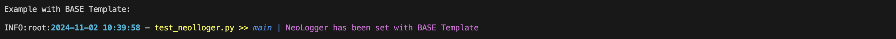
</p>

* NORMAL 
```
neologger.set_template(Template.NORMAL)
neologger.log_this("NeoLogger has been set with NORMAL Template")
```
Output:
<p align="center">
  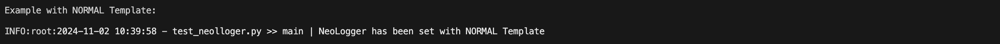
</p>

* DARK 
```
neologger.set_template(Template.DARK)
neologger.log_this("NeoLogger has been set with DARK Template")
```
Output:
<p align="center">
  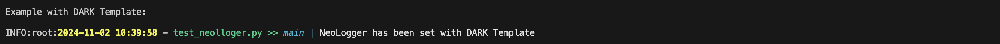
</p>

### 4 - Customising Logs display
NeoLogger lets you customise the logs on your own style, you can do this by importing FontColour and FontStyle classes from neologger.core package.

```
from neologger.core import FontColour, FontStyle
```

NeoLogger provides two methods to customise logs.   

The first method allow you to set the text colour for each of the sections of the log (date, file name, function name, message).

* Setting up Font Colour with _set_log_font_colour_

As in version 1.1.0, the folloging colours are available:
```
BLUE            # Light blue text
DARKBLUE        # Dark blue text
CYAN            # Light cyan text
DARKCYAN        # Dark cyan text
GREEN           # Light green text
DARKGREEN       # Dark green text
YELLOW          # Light yellow text
DARKYELLOW      # Dark yellow text
RED             # Light red text
DARKRED         # Dark red text
MAGENTA         # Light magenta text
DARKMAGENTA     # Dark magenta text
GREY            # Light grey text
DARKGREY        # Dark grey text
BLACK           # Black text
WHITE           # White text
```

Set the custom Font colours.

```
neologger.set_log_font_colour(FontColour.CYAN, FontColour.GREEN, FontColour.RED, FontColour.YELLOW)
neologger.log_this("Font colour has been customised")
```
Output:
<p align="center">
  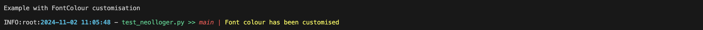
</p>

* Setting up Font Style with _set_log_font_style_

As in version 1.1.0, the folloging styles are available:
```
BOLD                # Bold text
ITALIC              # Italic text
UNDERLINE           # Underlined text
DOUBLEUNDERLINE     # Double underlined text
DIM                 # Dim text
NORMAL              # Normal intensity text
```

Set the custom Font styles.

```
neologger.set_log_font_style(FontStyle.NORMAL, FontStyle.ITALIC, FontStyle.BOLD, FontStyle.UNDERLINE)
neologger.log_this("Font style has been customised")
```
Output:
<p align="center">
  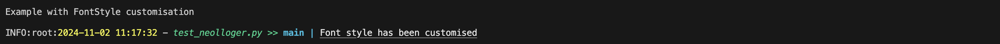
</p>